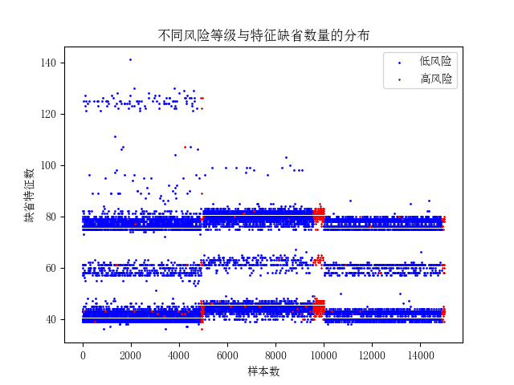
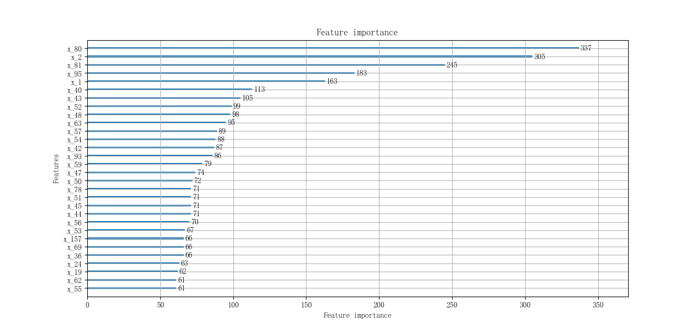
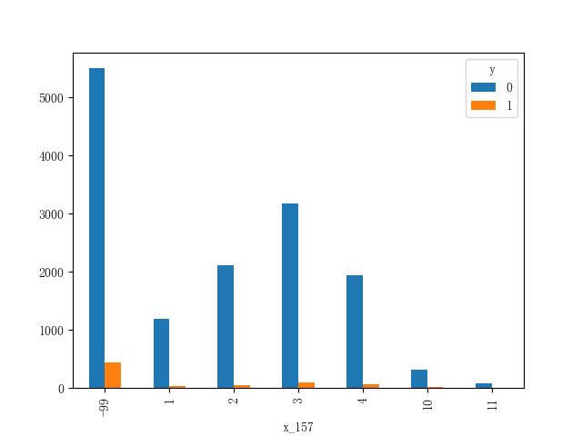

# 建模练习小结 
## 1. 任务简述
运用统计和机器学习模型对客户信用风险进行预测是金融机构风险管理关注的重要问题。本任务基于多客群的高维特征数据和表现数据（部分有标签，部分无标签）

对客户的信用风险进行预测。详细信息参照  https://challenge.datacastle.cn/v3/cmptDetail.html?id=230

## 2. 数据说明
根据赛题任务，此次竞赛提供的数据包括用户(cust_id)，157项脱敏的属性/行为特征(x_1-x_157)，以及是否属高风险用户的标签项(y), 其中, x_1-x_95是

数值型变量，x_96-x_157是类别型变量。标签y的取值中，“0”代表低风险用户(负样本)，“1”代表高风险用户(正样本)。

可供下载和使用的有3个文件： 

1.train_xy.csv，带标签的训练集数据，共15000条 

2.train_x.csv，不带标签的训练集数据，除无标签字段‘y’外，其余字段与train_xy.csv相同，共10000条 

3.test_all.csv，测试集数据，除无标签字段‘y’外，其余字段与train_xy.csv相同，共10000条

任务问题属于二分类问题，train.xy正负样本比例 691 : 14309 ≈ 1 ：20.7 ，评估指标为AUC， 随机抽取测试集40%样本作为A榜数据，剩下60%作为B榜数据

##  3. 数据分析和处理
### 3.1 缺省值分析
首先统计train_xy中157项特征字段的缺省情况，如图所示。

各项特征的缺省率大致可分为(≈0 / 0.4-0.6 / ≈0.99)三个阶层，比例接近10 : 5 : 5 。大部分特征缺省率较高，可能影响模型训练。


再看train_xy中每条样本的缺省情况，如图所示(其中红色代表正样本)。

正样本可能出现在不同缺省度层级中，缺省值数量不适合直接作为监督学习的特征。**正样本可能与特定的缺省值有关**。


根据每条样本缺省的特征个数统计信息，将缺省值个数进行离散化为M个区间，加入到训练和测试数据中。实验表明M为7，即约157/7≈20个缺省值个数为一阶时

效果最好(AUC_A≈+0.0035 AUC_B≈+0.0021)


### 3.2 特征重要性
一般来说，对于高维特征进行监督学习需要对缺省程度高的字段进行删除，以减小模型训练中的噪音。LightGBM(LGBM)作为常见的决策树模型，能够在生成

子树的过程中自动确定特征的重要程度完成选择，缺省程度高且区分度差的特征其重要性自然趋于0。删除缺省程度高但具有区分度的特征反而会降低模型效果。

因此，在后续训练中没有删除任何特征，这样**有助于保留数据特性**。用train_xy作为训练集训练LGBM，输出特征的重要程度如图所示。


### 3.3 缺省值填充
结合上述分析，观察到重要性Top10中的多数特征没有缺省(x_80, x_2, x_81, x_95, x_1, x_40, x_52, x_48), 个别特征缺省程度也不高(x_43, x_63)。基本符

合LGBM可以自动选择特征的预期。此外Top30中的类别型特征x_157有相当一部分缺省值，且缺省时区分度较强。因此，保留类别特征的缺省值不进行填充。


缺省值填充策略：**对数值型特征，采取均值填充；对类别型特征，保留原样不填充**

对特征的过度填充或不正常填充也会引入更多噪音，在实验中选去重要性Top K=0, 5, 10, ...,30 的特征进行缺省值填充，最终 K=10的效果最好

### 3.4 数值排序化
由于只有极少数特征填充了缺省值，其他数值型特征中存在-99取值往往同正常数值范围存在很大偏离，于是将通过`rank()`方法将数值转化为排序并归一化。

这样处理的目的主要是**减少异常值对模型的影响，降低过拟合风险**。实验表明有一定提升(AUC_A≈+0.0037 AUC_B≈+0.0019)

此外，将类别特征输入LR SVM等模型前通常还要单独进行one-hot编码，LightGBM文档中提到“LightGBM可以直接使用类别特征，不需要单独编码”，因此对

类别型变量x_96-x_157不进行one-hot编码

## 模型训练和评估
因为数据正负样本分布极不均衡，在划分数据集时，采用保持分布的分层抽样`StratifiedKFold()`，分5层交叉验证

| 模型 | AUC_A | AUC_B | AUC_Val|
|:-:|:-:|:-:|:-:|
|**standard**|**0.7527**|**0.7582**|0.8185|
|NanBins_10|0.7497|0.7606|0.8187|
|NoNanBins|0.7492|0.7561|0.8181|
|NoRank|0.7490|0.7563|0.8183|
|NoFill|0.7496|0.7550|0.8190|


```python

```
